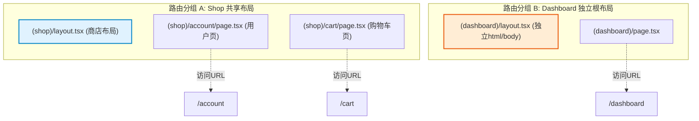
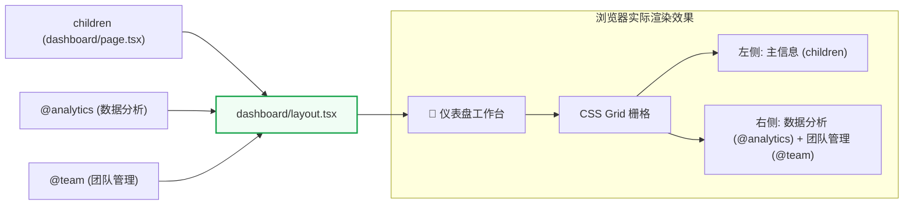
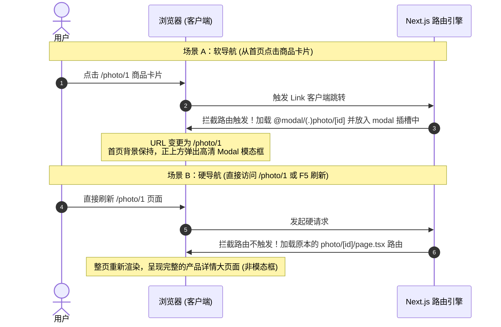

# 🚀 Next.js 路由核心机制学习与实践手册

本仓库用于系统性地学习并实践 Next.js App Router 的三大高阶路由特性：**路由分组 (Route Groups)**、**平行路由 (Parallel Routes)** 和 **拦截路由 (Intercepting Routes)**。

我们已在本项目中成功实现了一个**高颜值的数码产品商城**与**工作台仪表盘**，将这三种路由模式有机地融合在了一起。

---

## 🎨 核心概念与运作图解

### 1. 路由分组 (Route Groups)
通过使用括号包裹文件夹名 `(folderName)`，我们可以对路由进行分组，而**不影响 URL 路径结构**。

#### 💡 核心应用场景与结构图：

* **用法一：共享布局而不改动 URL**
  * 项目中的 `(shop)` 路由组包含了 `/account` 和 `/cart`。它们共享 `(shop)/layout.tsx`（内含购物车快捷栏），但实际 URL 仍然是 `/account` 和 `/cart`，去除了多级嵌套。
* **用法二：创建多个根布局 (Root Layout)**
  * 通过将不同的页面拆分进 `(marketing)` 和 `(dashboard)` 路由组中，它们可以分别拥有独立的 `layout.tsx`。这使得你可以彻底删除最外层的 `app/layout.tsx`，从而为前台和后台生成截然不同的 `<html>` 和 `<body>` 页面骨架。

---

### 2. 平行路由 (Parallel Routes)
平行路由允许你通过 **插槽 (Slots)**，在同一个视图/布局下同时或条件性地渲染多个页面，支持独立的状态管理、错误处理和加载状态。

#### 💡 仪表盘插槽组装逻辑：
我们在 `/dashboard` 下挂载了两个插槽 `@analytics`（数据分析）和 `@team`（团队列表），它们被自动以 props 形式传入 `dashboard/layout.tsx` 进行并列渲染：



#### 🛡️ 容错保障：`default.tsx`
在硬导航（刷新浏览器或直接敲击回车）访问子路径时，Next.js 会检查所有插槽是否匹配当前路径。若某些插槽不匹配，会导致 404 错误。
* **解决方案**：在 `@analytics` 和 `@team` 目录下均提供 `default.tsx`，直接 re-export 同级 `page.tsx`。
```typescript
export { default } from './page';
```

---

### 3. 拦截路由 (Intercepting Routes)
拦截路由允许你在当前上下文内“拦截”外部路由，并将其内容加载入当前的 Layout 中。通常与平行路由组合来渲染**模态框 (Modal)**。

本仓库实现了一个经典的 **图片/商品详情查看器**：

#### 💡 客户端跳转 (拦截模式) 与 页面刷新 (完整模式) 的对比流程图：



#### 📁 拦截匹配前缀规则：
* `(.)` 匹配 **同级** 路由段 （本项目使用此规则拦截 `/photo/[id]`）
* `(..)` 匹配 **上一级** 路由段
* `(..)(..)` 匹配 **上两级** 路由段
* `(...)` 匹配 **根 `app`** 目录路由段

---

## 🛠️ 项目主要文件结构清单

你可以前往以下核心代码文件，学习详细实现细节：

* **根布局配置**：[src/app/layout.tsx](./src/app/layout.tsx)
  * 引入了 `{modal}` 插槽以实现拦截路由。
* **商城首页画廊**：[src/app/page.tsx](./src/app/page.tsx)
  * 包含商品 Grid 卡片并使用 `next/link` 导航，采用 `"use client"` 进行微交互过渡动画设计。
* **拦截路由页面**：[src/app/@modal/(.)photo/[id]/page.tsx](./src/app/@modal/\(.\)photo/\[id\]/page.tsx)
  * 渲染一个漂亮的毛玻璃背景弹窗，展示产品大图与基本参数，通过 `router.back()` 实现返回。
* **独立详情路由**：[src/app/photo/[id]/page.tsx](./src/app/photo/\[id\]/page.tsx)
  * 独立的客户端页面，当复制链接直接打开时提供极具高级感的排版视图。
* **平行路由仪表盘布局**：[src/app/dashboard/layout.tsx](./src/app/dashboard/layout.tsx)
  * 实现了基于 CSS Grid 的多插槽工作台。

---

## 🚀 启动与调试

1. 安装依赖项：
   ```bash
   pnpm install
   ```
2. 运行本地开发服务器：
   ```bash
   pnpm dev
   ```
3. 构建并预览生产环境（验证预渲染路由结构）：
   ```bash
   pnpm build
   ```


