# Next.js 16.x 数据获取、缓存与重新验证实战指南

本项目是基于 **Next.js 16.2.7 (React 19)** 构建的交互式数据获取与缓存演示系统。旨在通过可视化的方式直观展现 Next.js 核心的缓存状态管理（Data Cache）与重新验证机制。

---

## 🛠️ 项目演示结构

- **[主页/中控台](./app/page.tsx)**：汇总 5 种缓存场景的技术特性，提供直观的指标矩阵对比。
- **[动态不缓存](./app/demo-no-cache/page.tsx)**：演示 `no-store` 请求，展示高频更新的动态数据行为。
- **[强静态缓存](./app/demo-force-cache/page.tsx)**：演示 `force-cache` 请求，体验毫秒级响应的数据持久化。
- **[时间重验证](./app/demo-time-revalidate/page.tsx)**：演示 `revalidate: 10`，解析 Stale-While-Revalidate (SWR) 双异步机制。
- **[组件与函数缓存](./app/demo-component-cache/page.tsx)**：演示 React `cache` (请求记忆化) 与 Next.js 16.x 全新 `"use cache"` 指令。
- **[按需重验证](./demo-on-demand/page.tsx)**：演示 `tags: ['time-data']`，体验结合 Server Action 瞬间驱逐缓存的交互。
- **[API 时间路由](./app/api/time/route.ts)**：后端高精度时间数据生成器，模拟 200~500ms 延迟以增强前台缓存体验。

---

## 💡 Next.js 16.x 核心缓存与获取机制知识库

### 一、 经典四大缓存机制在 16.x 中的状态与变更

在以往的 Next.js 版本中，官方定义了四种缓存层次，在 **Next.js 16.x (基于 React 19)** 中，这四种缓存依然扮演着重要角色，但其**默认行为**与**API 异步化**发生了关键的升级变更：

#### 1. Request Memoization (请求记忆化 / React `cache`)
* **原理**：在单个服务端渲染请求树（Request-Response 生命周期）的生存周期内，对同一个 API 或慢计算进行去重。
* **16.x 机制**：依然内置于 React 服务端运行时中。对于 `fetch` 请求自动启用；对于自定义普通查询，可通过导入 React 的 `cache()` 函数实现手动包裹。
* **时效**：在渲染页面生成 HTML 后便即刻销毁，不跨越用户请求共享。

#### 2. Data Cache (数据缓存)
* **原理**：跨越用户请求、跨越物理请求以及构建部署的服务端持久化数据缓存。
* **16.x 变更**：**默认缓存策略变更**。在 Next.js 14 中，`fetch` 默认会缓存（即 `force-cache`），而在 16.x 中，默认的策略是 **`no-store`**（不缓存）。这极大地避免了新手开发者因静态缓存导致的数据不更新疑惑。

#### 3. Full Route Cache (完整路由缓存)
* **原理**：在构建或静态重新验证时，在服务器端自动对静态生成的 HTML 和 React Server Component (RSC) Payload 进行页面级强缓存。
* **16.x 变更**：由于 Next 16 的上下文 API（`headers()`、`cookies()`、`searchParams` 等）在 React 19 下全部变为了**异步 Promise**，一旦页面在读取这些值前使用了 `await`，该路由页面会自动从“静态路由”降级为“动态渲染路由 (Dynamic Route)”，从而跳过完整路由缓存。

#### 4. Router Cache (客户端路由缓存 / 内存缓存)
* **原理**：当用户在客户端应用中点击 `<Link>` 跳转路由时，浏览器内会缓存已加载的 RSC 树，防止重复请求已访问过的路由。
* **16.x 变更**：**生命周期缩短**。在 Next.js 15+ 和 16 中，对于静态路由（Static Routes），客户端路由缓存默认保持 5 分钟；而对于动态路由（Dynamic Routes），默认缓存保持 **0 秒**（即每次点击跳转都会在客户端刷新去抓取最新 RSC 树，不再像旧版中默认缓存 30 秒）。

---

### 二、 React 19 & Next.js 16 全新引进的组件/函数级缓存

除了上面经典的四种缓存，Next.js 16 与 React 19 紧密协作，推出了更加细粒度的原生代码级缓存抽象，用以取代原有的 `unstable_cache`：

#### 1. React `cache()` 请求记忆化函数
* **核心代码**：`const getData = cache(async () => { ... })`
* **应用场景**：在开发复杂组件结构时，Navbar 组件和主 Body 组件都需要根据当前 `userId` 读取数据库。在最外层读取再传参 (Prop Drilling) 会破坏组件的独立性。使用 `cache()` 包装函数后，你可以在 Navbar 和 Body 里同时并发调用 `await getData()`，React 保证在当前请求周期内仅运行一次底层逻辑，自动合并去重。

#### 2. Next.js `"use cache"` 指令（持久化组件与函数缓存）
* **开启方式**：需在 `next.config.ts` 中开启 `experimental: { useCache: true }`。
* **核心代码**：
  ```typescript
  async function queryDatabase() {
    "use cache";
    // 该指令会将整个函数的返回结果，甚至是 Server Component 渲染出的 UI，放入 Data Cache 进行跨请求持久化缓存
  }
  ```
* **控制缓存寿命**：可以通过在函数内部首行声明 `cacheLife` 指令来精细化控温：
  ```typescript
  import { cacheLife } from 'next/cache';
  
  async function computeData() {
    "use cache";
    cacheLife({ revalidate: 10 }); // 缓存 10 秒
    
    // 复杂的非 fetch 数据操作或大运算
  }
  ```
* **优势**：不再局限于 `fetch` 网络请求的网络补丁，为非 `fetch` 调用（如 Prisma/Drizzle SQL 数据库查询、复杂的数据结构递归重计算）提供了完全统一、高性能的内置服务端持久缓存手段。

---

## 🔮 Next.js 16.x 渲染原理 (Rendering Fundamentals)

Next.js（特别是 App Router 架构）的渲染原理是围绕 **React Server Components (RSC)** 与 **Client Components** 构建的一套高效混合渲染体系。

### 1. 组件的双重身份 (RSC 与 Client Components)

Next.js 将组件严格划分为两类，从根本上决定了代码的运行位置：

* **React Server Components (服务端组件 / 默认)**：
  * **运行位置**：**仅**在服务器端运行。
  * **特点**：可以直接读取数据库、文件系统；其代码不会被打包发送到浏览器，这意味着 **0 客户端 JS 体积**，极大优化了页面加载速度。
* **Client Components (客户端组件)**：
  * **声明方式**：文件顶部声明 `"use client"`。
  * **运行位置**：先在服务端进行预渲染（生成 HTML），然后浏览器下载其 JS 代码，在**客户端**激活交互。
  * **特点**：可以使用 React 状态（`useState`）、生命周期（`useEffect`）以及浏览器的 Web API。

### 2. 服务端到客户端的渲染流水线 (Sequence)

当用户请求一个页面时，Next.js 服务端和客户端将经历以下渲染流程：

```mermaid
sequenceDiagram
    participant Browser as 浏览器 (Client)
    participant Server as Next.js 服务器 (Server)
    participant DB as 数据库/API

    Browser->>Server: 1. 请求路由 (如 /dashboard)
    rect rgb(20, 30, 45)
        Note over Server, DB: 服务端渲染阶段 (Server Render)
        Server->>DB: 2. Server Components 直接抓取数据
        DB-->>Server: 返回数据
        Server->>Server: 3. 解析 RSC 树，生成 RSC Payload (虚拟 DOM 描述)
        Server->>Server: 4. 将 RSC Payload 转化为静态的 HTML 字符串
    end
    Server-->>Browser: 5. 立即流式传输 HTML + RSC Payload
    Note over Browser: 用户看到静态骨架 (首屏瞬间加载)
    Browser->>Browser: 6. 异步下载 Client Components 的 JS 代码
    Browser->>Browser: 7. 执行水合 (Hydration)，激活绑定点击等交互事件
    Note over Browser: 页面可交互
```



#### 关键概念：RSC Payload
RSC Payload 是 Next.js 渲染的中间媒介。它是一种高度压缩的序列化 JSON 数据，包含：
1. Server Components 渲染出来的实际 DOM 结构和数据。
2. Client Components 的占位符（Placeholders）以及要传递给它们的参数（Props）。
3. 样式表和脚本的引入链接。

### 3. 两种核心路由渲染模式 (Static vs. Dynamic)

Next.js 会在构建阶段 (Build) 或运行时自动判断页面属于哪种模式，这是页面性能优化的精髓所在：

* **静态渲染 (Static Rendering / 默认)**：
  * **机制**：在**构建时 (Build Time)** 或者在后台重新验证数据时（如 ISR），将整个页面渲染成静态 HTML 并缓存在 CDN / 服务端。
  * **特点**：速度极快，响应耗时几乎为 `0ms`。
  * **转化条件**：路由内不包含动态函数（如 `cookies()`、`headers()`）且数据获取为强缓存时。
* **动态渲染 (Dynamic Rendering)**：
  * **机制**：在**请求时 (Request Time)**，针对每个不同的请求实时在服务端进行 RSC 渲染和生成 HTML。
  * **转化条件**：一旦 Next.js 发现路由中使用了**动态函数**（如 `cookies()`、`headers()`、读取 `searchParams`）或者存在不缓存的 fetch 请求（`cache: 'no-store'`），整页会自动转为动态渲染。

### 4. 突破性的流式渲染与悬挂 (Streaming & Suspense)

在传统的 SSR 中，服务端必须等页面上**所有数据都加载完成**后，才能将 HTML 统一响应给浏览器，这会导致慢接口阻塞整页加载。

Next.js 16 深度支持 **Streaming (流式传输)**：
1. 你可以使用 `<Suspense>` 包裹慢速组件（例如一个复杂的订单列表组件）。
2. 服务端会**率先**将页面其余静态部分的 HTML 以及 `<Suspense>` 的 loading 骨架屏 HTML 发送给浏览器。
3. 慢速组件的数据在服务端加载完成后，服务端在**同一个 TCP 连接**中继续向浏览器推送该组件的真实 HTML 块。
4. 浏览器接收到后，会自动在原位置将 loading 骨架替换为真实的组件 DOM，整个过程无需页面重新刷新。

> [!NOTE]
> 这种“渐进式水合”和“流式数据填充”是 React 19 和 Next.js 16 能够承载超大型动态 Web 应用同时保持极佳首屏体验的核心秘密。

---

## 🚀 本地运行与调试

1. **安装依赖**：
   ```bash
   pnpm install
   ```
2. **启动本地开发服务器**：
   ```bash
   pnpm run dev
   ```
3. **访问系统**：
   打开浏览器访问 [http://localhost:3000](http://localhost:3000) 即可使用中控台进行调试。
