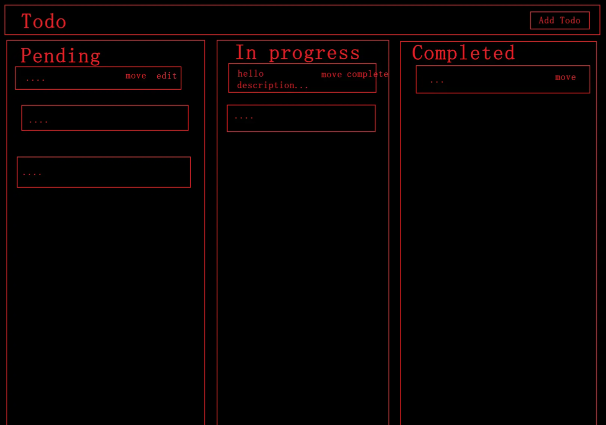

## 1. 实现一个 React 版的 TodoList 

要求：有状态、标题、描述信息，需兼容移动端。有 add 功能的弹窗

参考：

[React 实现看板式 TodoList](https://www.qianwen.com/chat/70abb650607b468ab135a6f2aeb62784)

## 2. 手写防抖和节流

## 3. 不同语言下的打包处理

概述：英语，中文，俄语等语言的一个 json 字符串文件在项目的某些地方使用到，如何在打包部署多个语言项目时，一个语言对应一个项目，其他多余的字符串给他去掉

